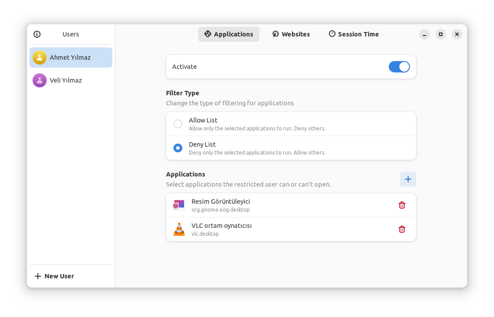
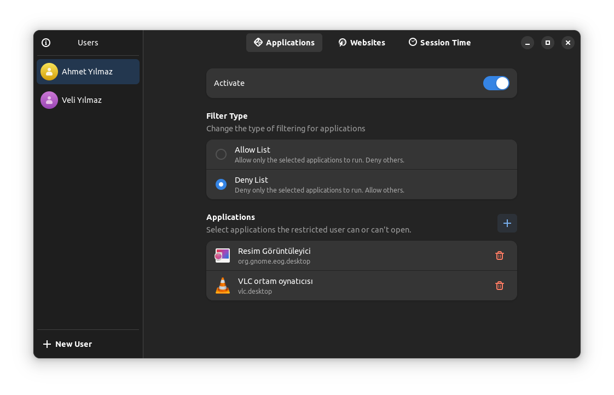
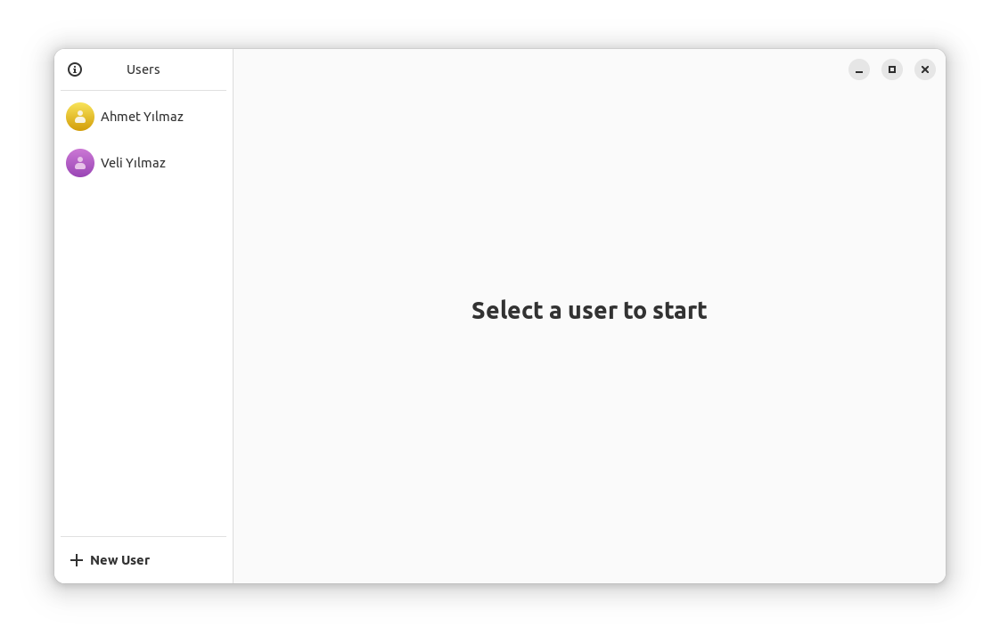
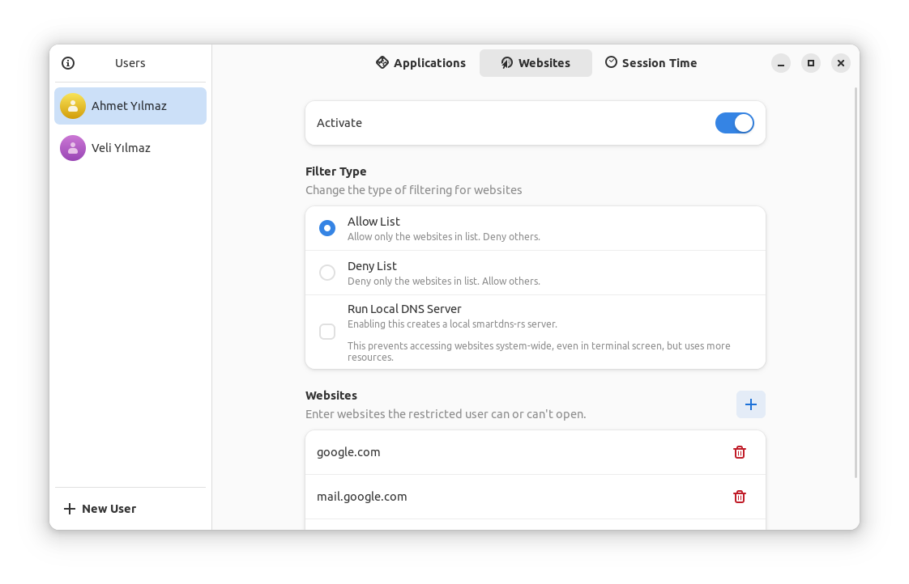
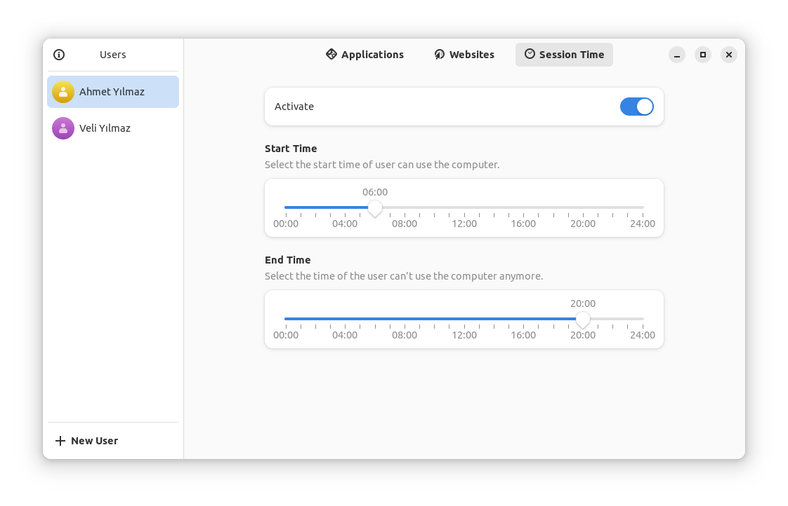

# pardus-parental-control
Parental Control application for Pardus.



## Features
- 📑 Application Filtering
  - **Allow Only** List
  - **Deny Only** List
- 🔗 Domain Filtering
  - **Allow Only** List
  - **Deny Only** List
- ⏰ Session Time Limit
  - Limit Session Times

## Screenshots


Dark Theme:






## Installation
Download the .deb file and install it with Pardus Package Installer.

or

```
sudo apt install ./pardus-parental-control_0.2.0_amd64.deb
```

## How does it work?
- [Application Filtering](doc/ApplicationFiltering.md)
- [Website Filtering](doc/WebsiteFiltering.md)
- [Session Time Limit](doc/SessionTimeLimit.md)

## How to create a .deb package from source?
Install required development packages:
```
sudo apt install devscripts git-buildpackage
```
Install dependencies & create .deb package from source code:
```
sudo mk-build-deps -ir
gbp buildpackage --git-export-dir=/tmp/build/pardus-parental-control -us -uc
```
