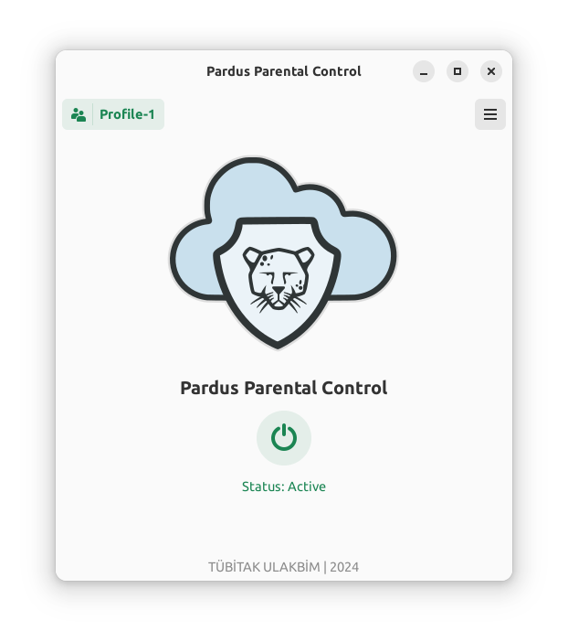

# pardus-parental-control
Parental Control application for Pardus.



## Features
- 📑 Application Filtering
  - **Allow Only** List
  - **Deny Only** List
- 🔗 Domain Filtering
  - **Allow Only** List
  - **Deny Only** List
- 🧑‍🧒 Profile Management
  - You can define different restrictions for different situations and use them. ()
## Installation
Download the .deb file and install it with Pardus Package Installer.

or

```
sudo apt install ./pardus-parental-control_0.1.0_amd64.deb
```
## How to run?
1. Open application with non restricted user
2. Edit Profile and add your own domains and applications
3. Start/Stop Parental Control Service with On/Off Button

## How does it work?
- Applications filtered by their DBus IDs or program names. (TODO)
- [Website Filtering](doc/WebsiteFiltering.md)

## How to create a .deb package from source?
Install required development packages:
```
sudo apt install devscripts git-buildpackage
```
Install dependencies & create .deb package from source code:
```
sudo mk-build-deps -ir
gbp buildpackage --git-export-dir=/tmp/build/pardus-software -us -uc
```
